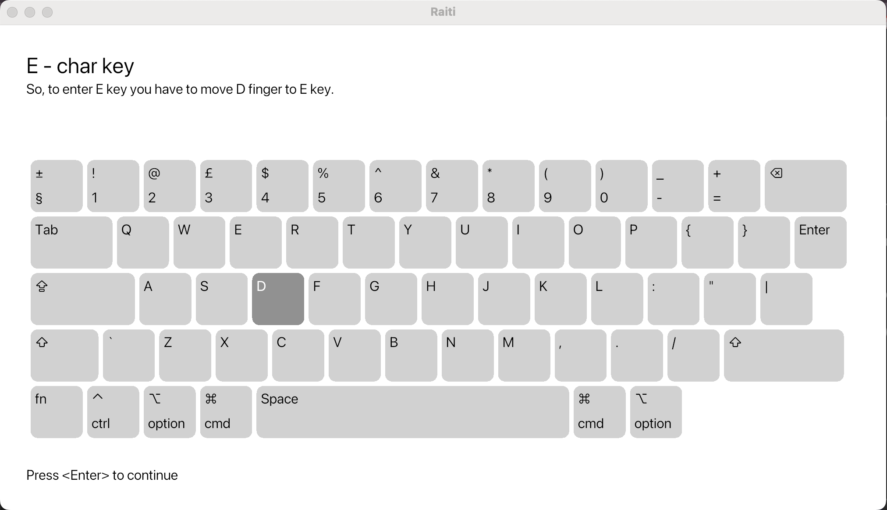
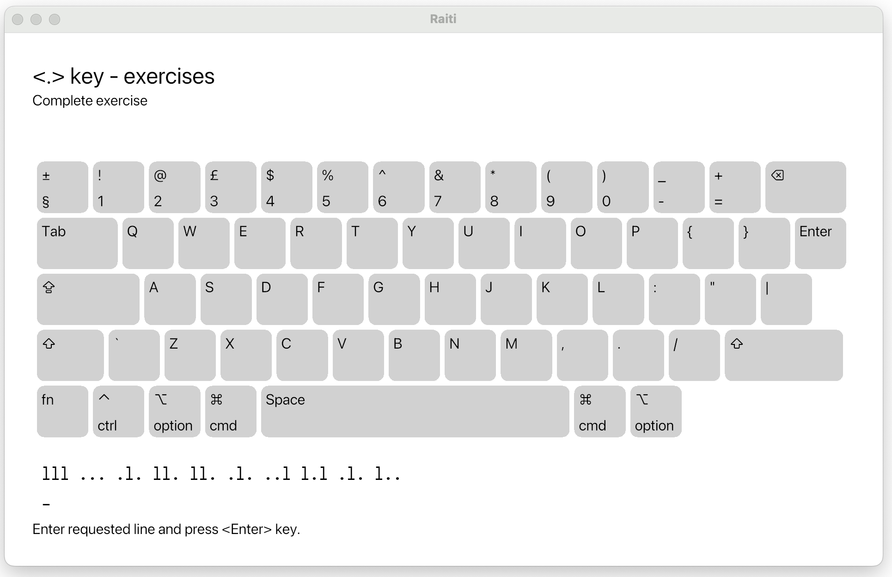

<a href="https://github.com/iced-rs/iced">
  
</a>


# TouchTyping learning app

Application to teach TouchTyping.

Letter introduction at keyboard:


Exercise with screen keyboard:


## Project aim

Project aim is:

   * should inlcude visualisation of easy customizable keyboard
   * training content should be possible to adapt to many languages
   * training should include all steps from very begining of blind typing
   * training should be done step by step while introducing letters one by one

## Installation

Download latest [release](https://github.com/gintsgints/raiti/releases) from GitHub and unpack.

## Statuss

Project is in active development phase and lot of code is subject to change.

## Project roadmap

Project is far from stable. For stable version we should implement:

  * basic keyboard graphical representation ✅︎
  * lesson configuration commands using yaml data files
    - show ilustrations on correct finger & body positions.
    - show key location ✅︎
    - show explanation text ✅︎
    - pictures of correct sitting and finger positions while typing
    - one line exercise with and without Enter at end
    - entry training with and without backspace usage - partly
    - speed improvement exercises with speed measurement
  * full course on query keyboard in yaml files
  * lesson table of contents, to choose any lesson to work on - partly
  * save state for lessons ✅︎
  * version packaging ✅︎

## Known issues

  * space key press is not recognized
  * while loading unfinished lesson at start (after exit), exercises not filled.

## Run project

To run project you should have rust infrastructure set up.
Then you can compile and run project using commend:

```
cargo run
```

## Similar projects

https://www.typingstudy.com/
